# LED产品
### 贴片型
- 0402 产品:164x 规格:1.0 * 0.5 * 0.35
- 0603 产品:194/192x 规格:1.6 * 0.8 * 0.4(0.6)
- 0606 产品:1942/193 规格:1.6 * 1.2 * 0.4 
- 0805 产品:170x 规格:2.0 * 1.5 * 0.8
- 1206 产品:150x 规格:3.2 * 1.6 * 0.8 
### 侧贴
- 0602 产品:192S/1922/1923 规格:1.6 * 0.5 * 0.3（0.4）
- 1204 产品:110/1102/1103 规格:3.2 * 1.0 * 1.5

### 支架
- 1016 产品:810/810H 规格:1.6 * 1.0 * 0.6
- 2016 产品:820/828  规格:2.0 * 1.6 * 0.65

## 闪光灯
### 828
- Q05  340lm@1A 5150-5850
- Q05C 340lm@1A 5250-5750
- Q05D 340lm@1A 5100-6100
- Q05M 340lm@1A 5250-5750
### 820
- JP4  140lm@500mA 5100-6100
- JP6  180lm@500mA 4500-5200
### 810
- JP1  155lm@500mA  4500-5200
- QA4  280lm@1A     4300-5000

### 820
- JP4  140lm@500mA   5100-6100
- JP6  180lm@500mA   4500-5200

### 垫高产品
- 为什么要做垫高？
有些项目结构比较特殊，因为手机的主板距离出光面比较远，所以如果选择普通的LED为了弥补这个缺陷，客户会把lens做厚。但是就算是把Lens做厚,也不能
达成一个很好的效果。这样处理会影响到出光角度，影响到出光角度就会影响到四角均匀度。而且由于把Lens做厚，光通过透镜肯定会增大损失。
- 垫高的好处是什么？
为了解决上面说的问题，客户会在主板上先贴一个小板，减小到出光面的距离来规避这个缺陷。但是如果客户自己来贴的话成本会比较高，需要贴两次，所以我们
直接将小板坐在灯珠下面，以模组的形式直接出给客户，那么客户就只需要贴一次就可以了。

### Lens厚度的建议

- Lens厚度的间隙
一般建议的厚度是0.25，Lens的厚建议为0.08-1.5之间。Lens越厚对出光效果影响较大
锡的厚度0.05

### 穿戴市场
- 目前市场上，客户的选型主要是以欧司朗为主，少部分台系，因此目前的市场价格会比较高的，我们内部的产品正研发中，
在光电参数上和欧司朗的是一样的，同时我们的焊盘是pin to pin的。目前产品呢在测试阶段，预计6月底或者七月初就会有产品正式出来，未来由我们来做
的话在价格上肯定是具有一定优势的。

### 支架式高寿命 1016
- 材质
支架式，闪光的材料
- 高寿命，低光衰
普通指示灯正常使用的情况下，寿命为3万小时。这颗灯是6万小时。
- 省功耗
- 发热率低 20毫安的电流下发热为0.7

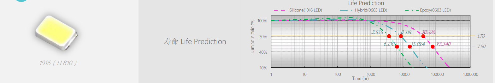

### 单电极双电极
- 双电级
绿光晶片 蓝光晶片

### 耳机项目
- 龙旗
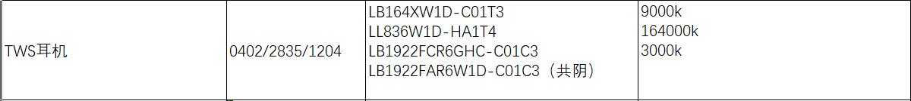
- 闻泰
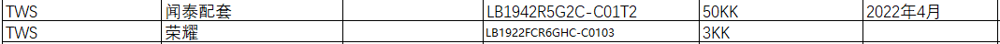
- 中诺  
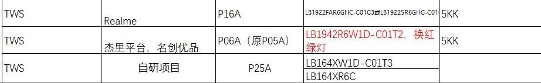
- 华勤

### 手机项目
- 龙旗
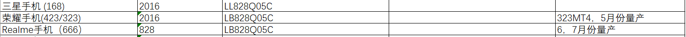
- 闻泰
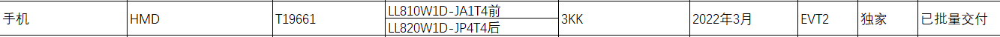
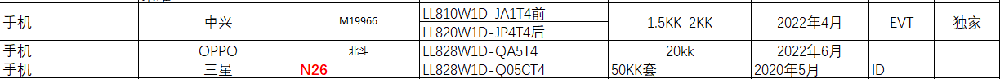
- 中诺
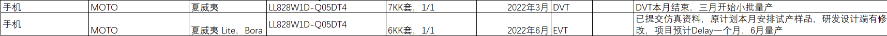

## 指示灯
- 70迈
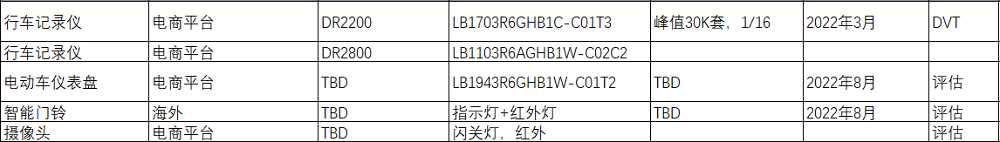
- 赛嘉

- 闻泰
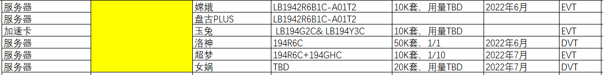
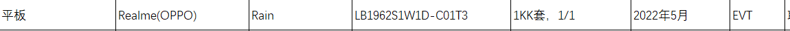
- 龙旗  
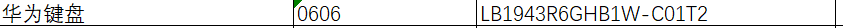
- 华勤
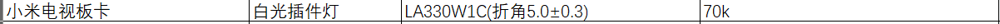
- 高德
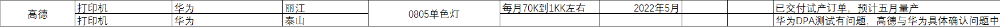

